## Introduction
The goal of this lab is to create familiarity with the FPGA and MCU boards used in E155. 
Key deliverables include building the development board, writing Verilog to control LEDs,
programming the FPGA in verilog, getting comfortable with working with circuits, and 
working with a 7-segment display board.

## Design and Testing Methodology
Hardware was assembled following the [Lab 1 Instructions](https://hmc-e155.github.io/lab/lab1/). The board was built using a combination of hand soldering and soldering paste. 

To make LED 2 blink at 2.4Hz, I used a counter to convert from the on-board high speed oscillator (HSOSC) to a square wave with a duty cycle of 50%. To do this, I found the ratio between the input, 6MHz, and output frequencies and used that as the counter MAX. Then, I had the LED turn on if the counter was higher than half the MAX value and turn off when the counter hit the MAX and reset to zero. 

::: {.callout-caution collapse="true" title="spoiler: counter calculations"}
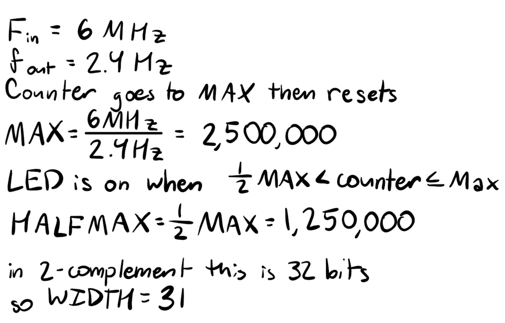
:::

For LEDs 0 & 1, I programed them with combinational logic from switches 0-3 using behavioral verilog.

For the 7 segment display, I programed the different states using a case statement. The numbering scheme and truth table I used is shown below. 

::: {.callout-caution collapse="true" title="spoiler: 7-segment display layout and truth table"}
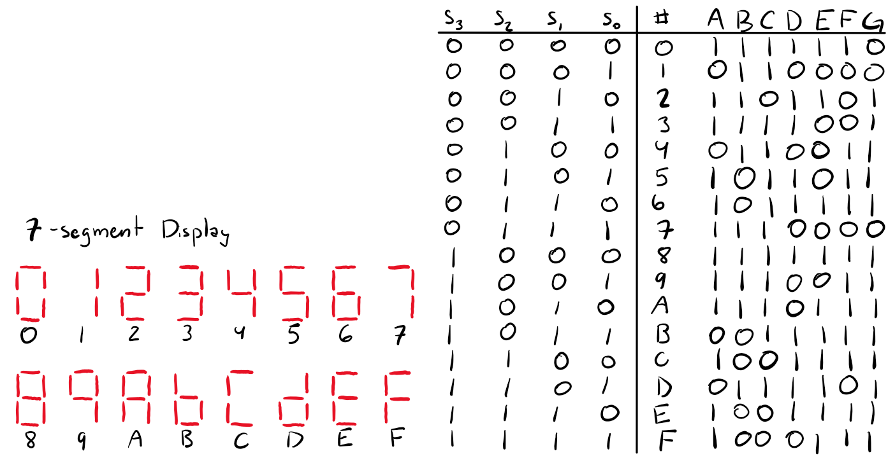
:::

To ensure that the GPIO pins remained within current limits, 7mA was targeted for the current across each pin. Referencing the data sheet for the 7-segment LED, at 5mA the voltage drop across each diode is approximately 1.9V. Using, the 3.3V power supply to the shared anodes, this requires the current limiting resistor to be 200 ohms. Using real resistor values, 185 ohm resistors were chosen. The 3.3V voltage supply was used to reduce the total power draw from the board. 

To test, three different test benches were created. The first was a test bench for the switch to 7-segment display. Becuase there were only 16 possible inputs, all input options were tested with assert statements. For the counter testbench, the WIDTH, MAX, and HALFMAX parameters were set to 4, 8, and 4 respectively. This allowed the test to run far faster. The test bench toggled enable and reset independently and together and the counter and led signals were observed. Because the counter signal is internal, no assert statements were used. Finally, a reduced set of test conditions was used to test the top module. s = [0000, 0101, 1010, 1111] was used to encompass the different possible inputs to the logic gates. Assert statements were used to test both the logic gates and the 7-segment display (to ensure that the modules were correctly linked). Additionally, the counter signal was observed in the waveform to ensure it counted correctly. 

## Technical Documentation

The schematic and block diagram below show the layout of modules and the wiring of the board. The modules were designed so that the internal high frequency oscillator, the switch to 7-segment display, and the counter are all individual modules called by the top module. The top module also contains the logic statements for LEDS 0 and 1 to reduce the lines of written code. 

::: {.callout-caution collapse="true" title="spoiler: schematic and block diagram"}
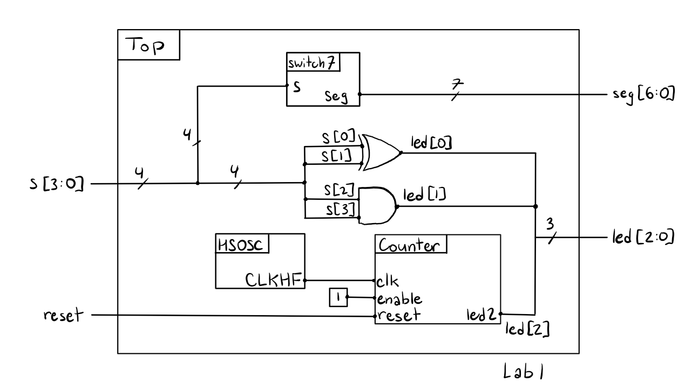
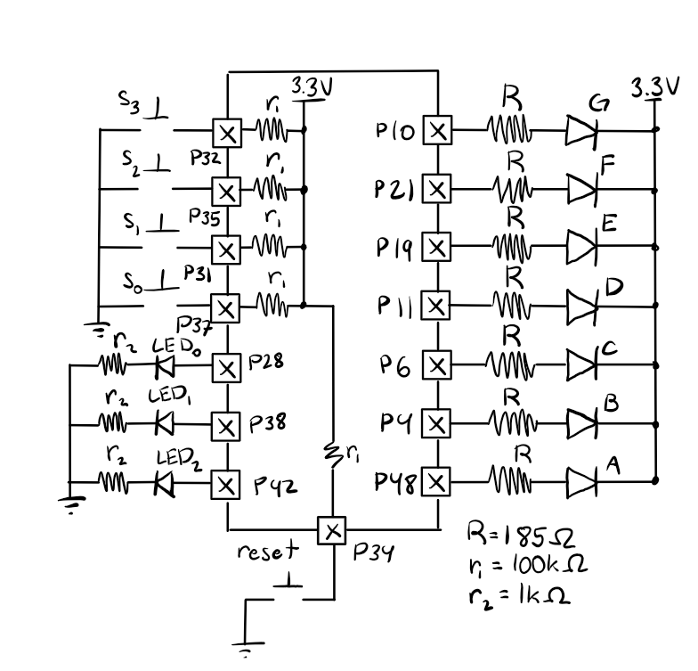
:::

## Code

Below is my code for the modules, testbenches, and AI reflection.

[code](https://github.com/lilyanfang/hmc-e155-lab1/tree/main)

## Testbench Results

The switches to 7-segment LEDs testbench ran successfully. As shown below, the tests all showed anticipated behavior. Additionally, the waveforms match the truth table (noting that the diodes are on for a seg value of 0). 

::: {.callout-important collapse="false" title="testbench waveforms and test results for switches to 7-segment LEDs"}
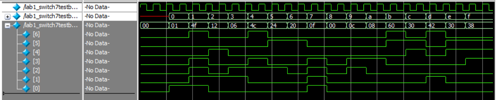
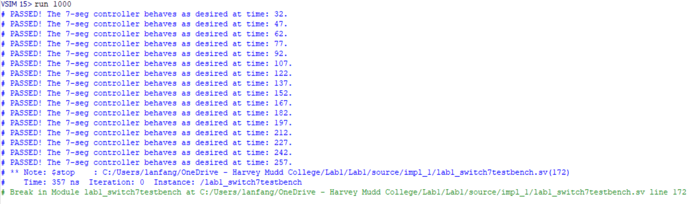
:::

The counter testbech also ran successfully. As shown below, the counter only activates when reset is off and enable is on. Additionally, the counter counts up to the specifed MAX paramet (for this test it was 8) before looping back to zero as expected. Finally, the LED 2 output signal also matches expectations as it is only on for the durration when the counter is between HALFMAX (4 in this case) and the MAX.

::: {.callout-important collapse="false" title="testbench waveforms for the counter"}
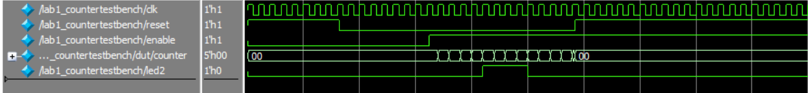
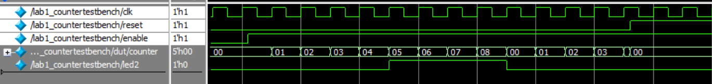
:::

The top modulue matches anticipated results as well. As expected, the counter and switch to 7-segment modules both work and show the same behavior as when they were tested individually. Additionally, the logic gates for LED 0 and 1 match the provided truth tables. Finally, estimating the wavelength of one clock cycle for the HSOSC, it is approximately 164ns, which maps to a frequency of roughly 6MHz as intended. As such, it can be concluded that at the set parameters for MAX and width, LED 2 will blink at 2.4 Hz because the HSOSC clock is at the intended speed and the counter module behaves correctly. 

::: {.callout-important collapse="false" title="testbench waveforms and tests for the top module"}
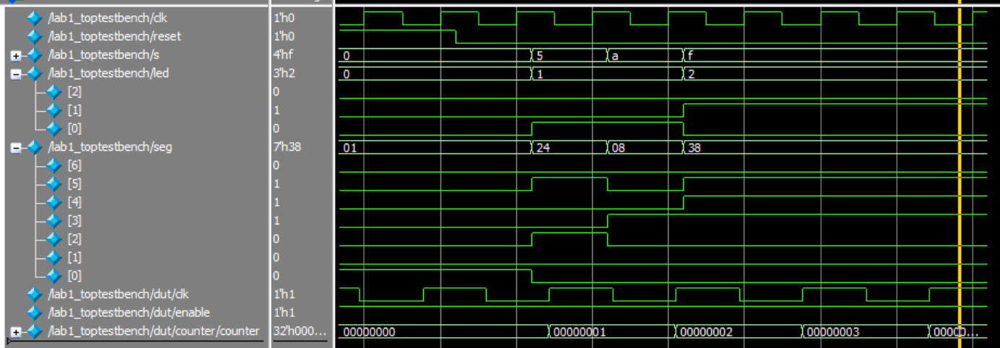
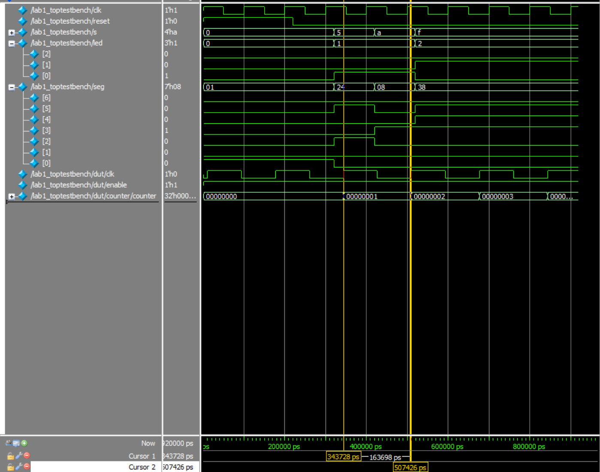
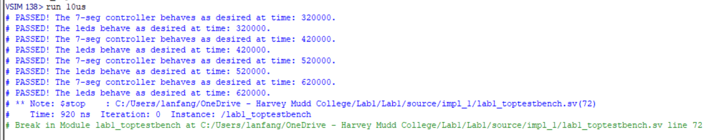
:::

## Hardware Results

To test on hardware, a switch was used for reset. As such, the code was modified to account for reset being low when pressed and otherwise high. This change was verified by modifying the testbench and it ran successfully. 

When uploaded to the board, the code ran successfully and met all specifications. A full sweep of the switch inputs showed both LEDs 0 and 1 as well as the 7-segment LED display had expected behavior. Additionally, LED 2 blinked 24 times over a 10 second period (shout out Enzo for helping me count), showing that it was blinking at a speed of 2.4Hz. The hardware setup for the board is shown below. 

::: {.callout-important collapse="false" title="hardware setup of board connected to 7-segment LED display"}
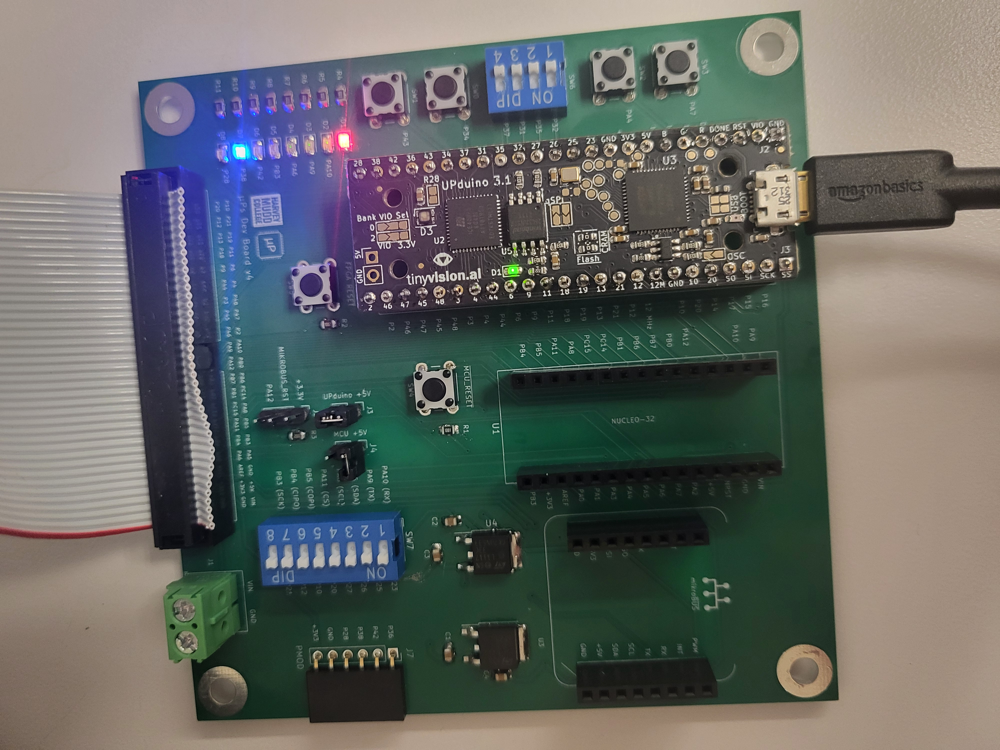
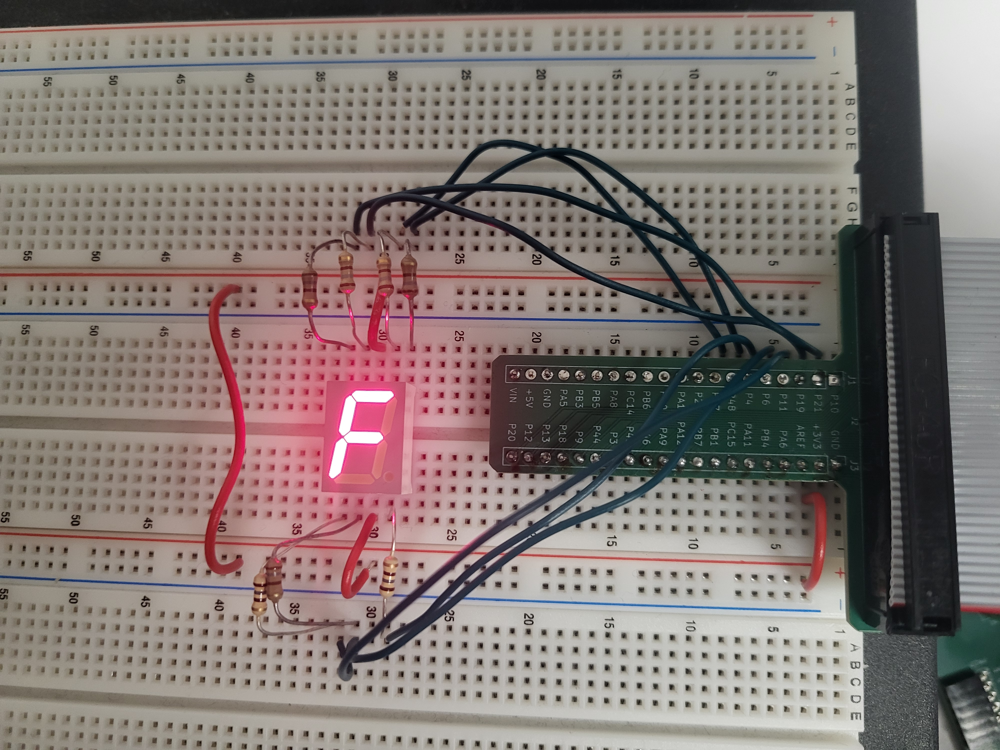
:::

## Conclusion

In this lab I built and programed a board to control a 7-segment LED display and 2 LEDs with switches, as well as to blink an LED at a prespecified rate using the onboard high-speed oscillator. This required using both combinational and sequential logic. Additionally, I coded 3 different test benches to verify my code. 
This lab took me about 18 hours but only about 10 of those hours were spent coding. 

## AI Prototype Summary

I used Gemini to write the code. It wrote code that successfully synthesized on the first try. I would say the quality is pretty high because the code included multiple comments correctly explaining the lines. However, these comments feel more like they were taken from a lecture and less like actual coding project because they explain the math but not the rationale for why certain design choices were made. However, there are a couple major flaws with the code that it wrote. Primarily, this code doesn't include a reset signal which, while not required, would likely be more useful for application. Secondly, at no point in the code is the LED's state explicitly set to 0 or 1. Instead, the code just toggles the LED value with a not gate. As such, if the LED starts out in an undefined state, this code could never get it to a defined state and the LED wouldn't blink.

The code it wrote used "SB_HFOSC" and "u_hfosc" which differed from the syntax we were provided in class but functioned the same. Other than that, there was really no new structures or syntax provided although it used a different method for toggling the LED than what I wrote in my code. 

If I were to use an LLM in my future workflow, I would likely consult it for specific syntax that I am not familiar with, like the HSOSC code. However, because I do not have a strong coding background I am very hesitant to use AI to help me code because skill building requires repetition and AI often eliminates that. Additionally, I don't support the environmental impacts of data centers because they disprortionately impact minority communities and perpetuate systemic environmental racism so I try to avoid using AI as much as possible when it isn't explicitly tied to my grade. 