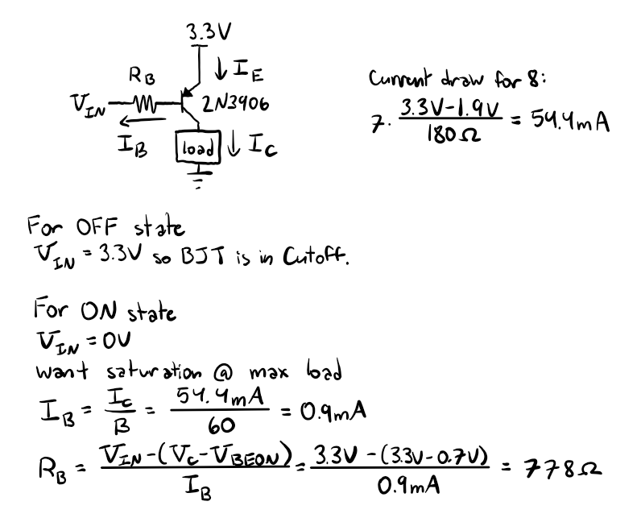
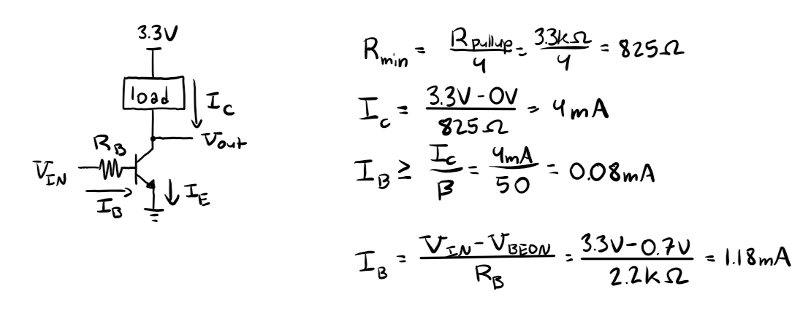
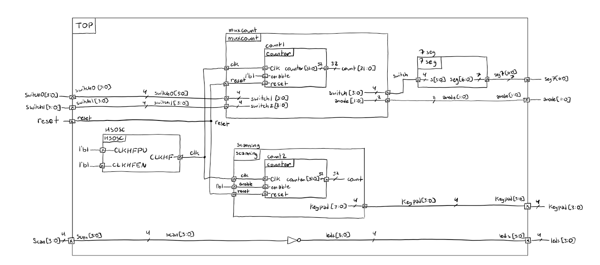
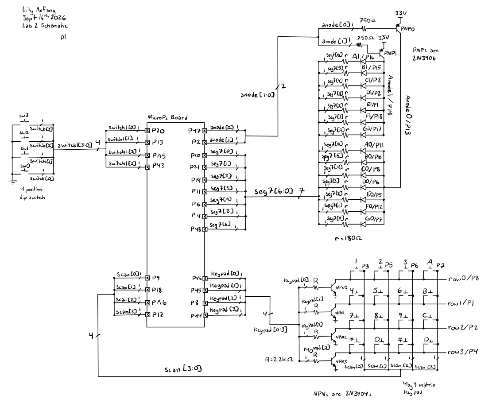
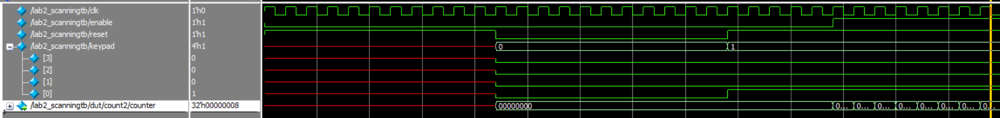
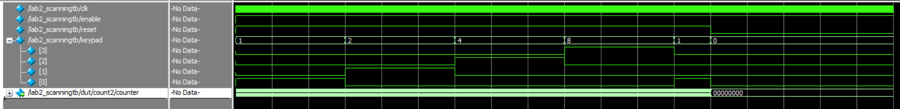
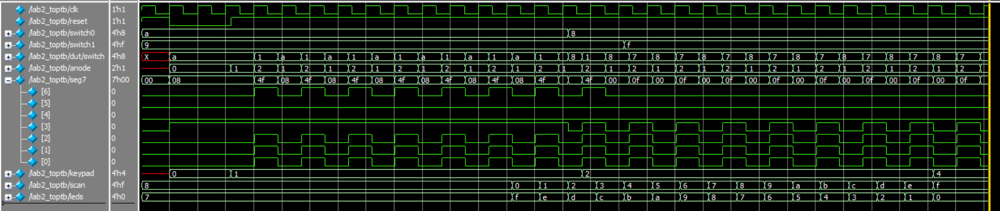
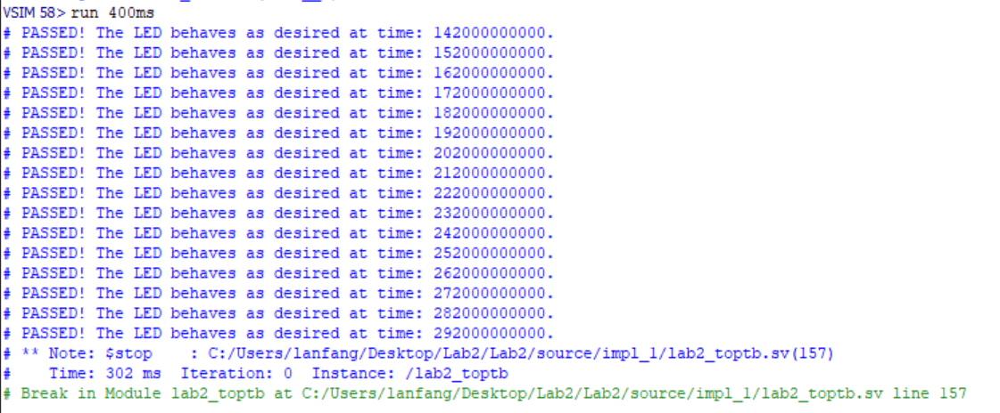
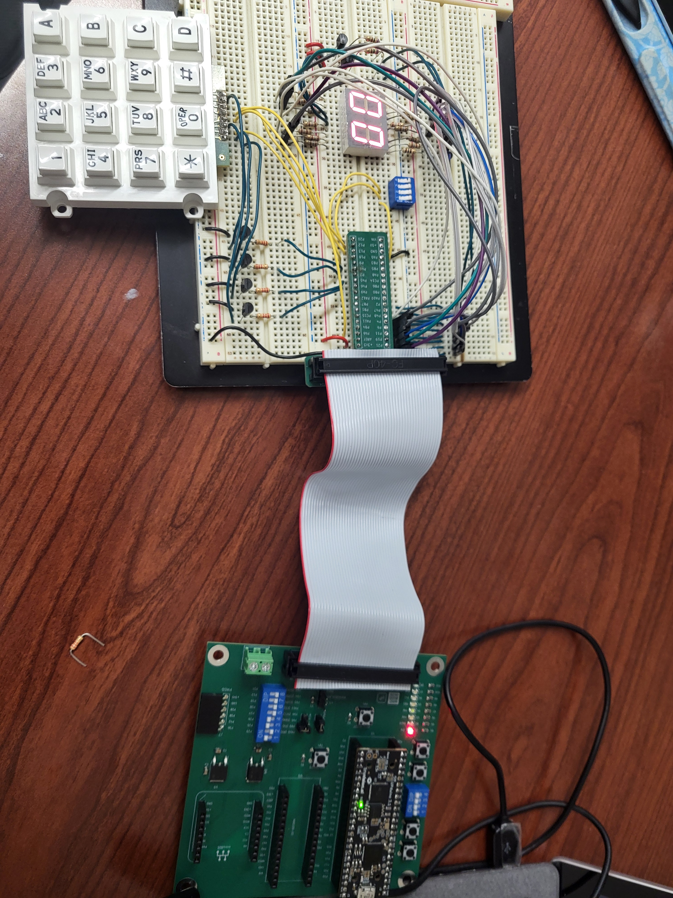

## Introduction

The goal of this lab is to gain practice with non-canonical finite state machines, learn how to use multiplexing to work under hardware constraints, and practice modular verilog. 

This lab includes two seperate functions for the FPGA. The first function is a multiplexing module that uses the same pins to drive two seperate 7-segment displays. The second function is to drive offset squre waves, each with a duty cycle of 25%, into the rows of a 4 by 4 matrix keypad and then use the output read off the columns to drive 4 LEDs. 

## Design and Testing Methodology

Hardware was assembled following the [Lab 2 Instructions](https://hmc-e155.github.io/lab/lab2/). 

Duplicating the calculations from Lab 1, I used 180 ohm current limiting resistors on the 7-segment display wiring to ensure that the current draw from the GPIO pins stayed below 8mA limit. This works despite each pin driving two different diodes because the anodes are multilexed. As such, only one anode is on at a time so only one LED will have the voltage drop across it required to turn on. Thus only one LED will ever be pulling current so the 180 ohm resistors are still sufficient for limiting current. 

However, because of the anodes need to be time multiplexed, they must be tied to GPIO pins instead of the 3.3V power. Given that each anode can power as many as 7 diodes simaltaneously, as is the case for the number 8, each anode must be able to supply 54.4mA of current which exceeds the current limit of GPIO pins significantly. As such, 2N3906 PNP BJTs are used to drive the current. 

When an individual diode is in the 7-segment display is turned off at the cathode, no current flows through it and it can be treated like an open circuit. When the diode is turned on by the cathode being set to ground, current flows from the collector of the BJT through the diode and the current limiting resistor to the cathode. Because the goal of this design is to have the BJT behave like a switch, when the diode is turned on at the cathode, the BJT should alternate between railing out in saturation (the anode is in the on state) and cutoff where no current flows (the anode is in the off state). 

To do this, the collector of the BJT must drive enough current to put the BJT in saturation and set the collector node to rail out at 3.3V. As such, in the condition with all LEDs on, the collector current must be 54.4mA. From the 2N3906 datasheet, the current gain is approximately 60 when the collector current is 50mA. As such, the minimum base current required is 0.9mA. This means the base resistor should be less than 778 ohms to drive enough base current. As such, 750 ohm resistors were used. 

::: {.callout-important collapse="false" title="calculations for anode BJT design"}

:::

For the keypad, BJTs were also used as switches. In this case, 2N3904s were used to cope with the shorting problem that can occur during multiple key presses. When no keys in a column are pushed down, there is no short to the row so the column is pulled high by the pullup resistor. When the input signal is grounded, the BJT is forced into cutoff and the column output is kept high by the pullup resistor. For the BJT to work like a switch, when the input signal is high the BJT needs to be in saturation so the output signal is grounded. 

When multiple keys are pressed in the same row, the pullup resistors in each column are placed in series, resulting in the resistance decreasing. As such, the minimum resistance is when all four keys are pressed down which is 825 ohms given that the internal pullup resistors are 3.3 kohms. Then, if the output voltage is set to ground the collector current needs to be 4mA. Based on the datasheet, the current gain can be approximated as 50 for a 4mA collector current. As such, the base current needs to be at least 0.08mA to keep the BJT in saturation. Given that this current is relatively low, the current limiting resistor was arbitratily chosen to be 2.2 kohms as it limits the base current to 1.18mA which is both within the tolerances for the GPIO pins and keeps the BJT in saturation. 

::: {.callout-important collapse="false" title="calculations for scanner BJT design"}

:::

To implement the given design goals I used two non-cannonical FSM modules fed by the high frequency oscillator set to 6MHZ. The first non-cannonical FSM was a multiplexing counter. This module used a counter to count to 100000 and set a variable to be true when the count was greater than 50000 thereby converting from the 6MHz clock to a 60Hz square wave. This wave was then used as the input to a mux that alternated between outputs between the two different switch inputs and their associated anode signal. This logic was then fed into a single 7-segment module to convert the switch signal to the input signal for the 7-segment display. The second non-cannonical FSM used the same method of the clock to get an output signal at a 2 Hz frequency. However, this signal was used to define the 4 bits in the output to the keypad by having each bit turn on with a 2Hz frequency with a 25% duty cycle and having each signal offset in phase by an eighth of a second. Finally, the top module also contained assign logic that converted the input from the scanner into the output for the LEDs. 

Because the counting and 7-segment logic were tested in lab 1, I did not repeat test benches for either. For the scanning module, I coded the initial portion of the testbench to show that reset sets everything to 0 and the module is enableable. I then let the module run long enough where the full behavior of the output process of [0001] -> [0010] -> [0100] -> [1000] could be observed and the wrapping behvior was seen. For the top module testbench, I used the initial portion to test the functionality of reset. I then let the module run long enough where the scanning module could clearly be seen changing. Additionally, I toggled through a couple different inputs from the switches to show the mux is functional. Finally, I ran through all 16 input options for the keypad to show that the LEDs have correct passthrough behavior. 

## Technical Documentation

The schematic and block diagram below show the layout of modules and the wiring of the board. 

::: {.callout-caution collapse="true" title="spoiler: schematic and block diagram"}

:::

## Code

Below is my code for the modules, testbenches, and AI reflection.

[code](https://github.com/lilyanfang/hmc-e155-lab2)

## Testbench Results

The testbench for the scanner shows expected behavior with the module being both enableable and resetable. Additionally, the module clearly shows the correct sequency and wrapping behavior. 

::: {.callout-important collapse="false" title="testbench waveforms for the scanner module"}

:::

The top module testbench ran successfully. It shows that the reset feature works correctly for the outputs. Additionally, it shows that the scanning behavior is correctly integrated. It also shows the mux is correctly alternating between the switch and anode outputs and that it is feeding the 7-segment module correctly. Additionally, all the tests for the LEDs are passed successfully. 

::: {.callout-important collapse="false" title="testbench waveforms for the counter"}

:::

It is important to note that due to some hardware constraints there are a couple oddities in the testbench. Primarily, because one of the switches for the switch1 signal is an onboard push button, it is high when not pressed so the signal is negated. This is why the mux switch output has the 3rd bit flipped compared to the input signal from switch1. Additionally, because the scan signals pull high when they are not recieving a signal from the keypad, the LEDs are fed the negated scan signal so they are only on when receiving the signal to flash. 

## Hardware Results

After some initial troubleshooting and reorganizing the pin assignments, the hardware worked successfully. There was no visible flickering for the 2 digit 7-segment display, the LEDs had consistent brightness no matter how many were on, and the display read correctly. Each button on the keypad triggers the correct LED to flash. When keys in the same row are pressed the respective LEDs all flash at the same time. When pins in the same column are pressed, the LEDs flashes for the high signal in both rows which either increaseds the duty cycle or increases the flashing frequency. When two buttons are pushed that share neither a row nor a column, the LEDs blink out of phase. 

::: {.callout-important collapse="false" title="hardware setup of board connected to 7-segment LED display"}

:::

## Conclusion

In this lab I programed my board to drive two 7-segment displays using shared pins with a mux. I also drove a keypad with offset 25% duty cycle waves with hardware designed to support multiple key presses. 

## AI Prototype Summary

I used Gemini to write the code. It wrote code that successfully synthesized on the first try for both options (I used Prof Brake's new software). The interesting thing with how it coded was on the first attempt it chose to code a latch (and explictly said so in the comments) to deal with the common anode. However, in the second attempt where it took my files because I fed it my old count file that output a clk signal it somehow understood that it needed to set the 7-segment display to off between turns rather than implying a latch. While this definately generated the code faster than I would have written it, the level of competency in writing does not instill me with faith for more complex code where catching bugs would be harder. 