## Introduction

The goal of this lab is to gain practice with the various types of FSMs and to practice switch debouncing. 

This lab displays the two most recent inputs from a keypad on a dual 7-segment display accounting for both switch bouncing, multiple presses, and double presses. 
## Design and Testing Methodology

Hardware was assembled following the [Lab 3 Instructions](https://hmc-e155.github.io/lab/lab3/). 

The full system was driven by offset 25% duty cycle square waves at 100Hz being driven into the keypad rows. The voltage on the columns was then read off. To synchronize the inputs a series of flipflops were used. To debounce the inputs the clock cycles for which and input ran high were counted over a 2ms period and if the input was high for more than 50% of the time the output was high. This debouncing method is effective because it functions basically like an averaging system. However, there are a couple main drawbacks. primarily it has to be triggered by an enable from the scan module to ensure that it only uses the relevant data from the current row rather than across two rows. Additionally, it delays the 7-segment display output because it needs to fully run before any following logic can start. A method that might not have this issue would be to only output if the current input has remained constant for a certain period of time but that would likely require more complex code. 

::: {.callout-caution collapse="true" title="spoiler: output logic for the counter FSM in the scan module"}
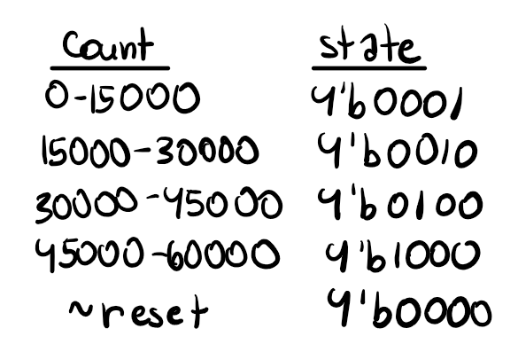
:::

::: {.callout-caution collapse="true" title="spoiler: scan module block diagram"}
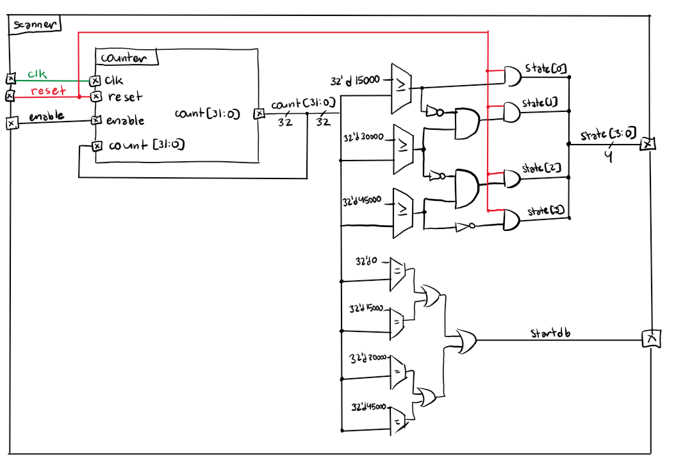
:::

::: {.callout-caution collapse="true" title="spoiler: debouncing module block diagram"}
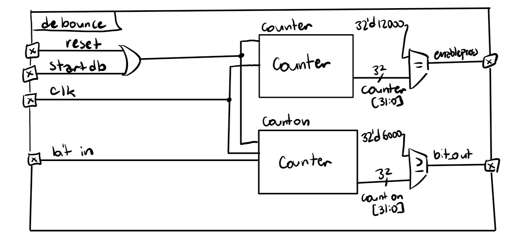
:::

::: {.callout-caution collapse="true" title="spoiler: sync module block diagram"}

:::

The scan module was already testing in Lab 2. The sync module was tested by checking that an input propogated through it in 3 clock cycles. The debouncing module was tested by testing various ratios of on to off for the input and ensuring that the output was correct. 

::: {.callout-caution collapse="true" title="spoiler: sync testbench waveform"}
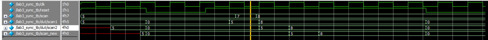
:::

::: {.callout-caution collapse="true" title="spoiler: debouncing testbench waveform and tests"}
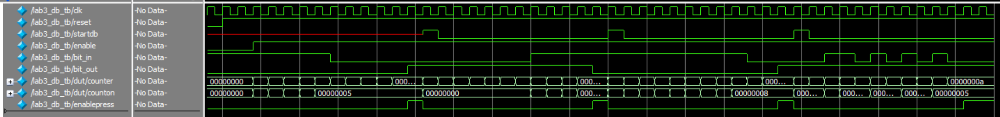
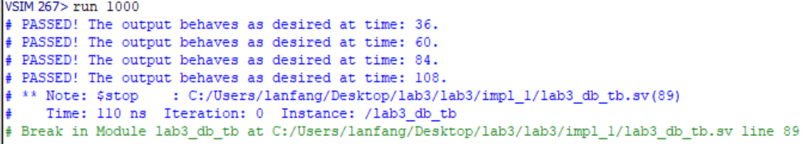
:::

Given the output states from the scan FSM and the enable signal from the debounce module,
which keys were pressed was determined by taking in the current state of which row was high and using that to determine which key each of the column readings mapped to. Then, only those keys had their state updated. This process was enabled by a signal sent from the debounce module that the debouncing process was complete. 

::: {.callout-caution collapse="true" title="spoiler: pressed module logic mapping"}
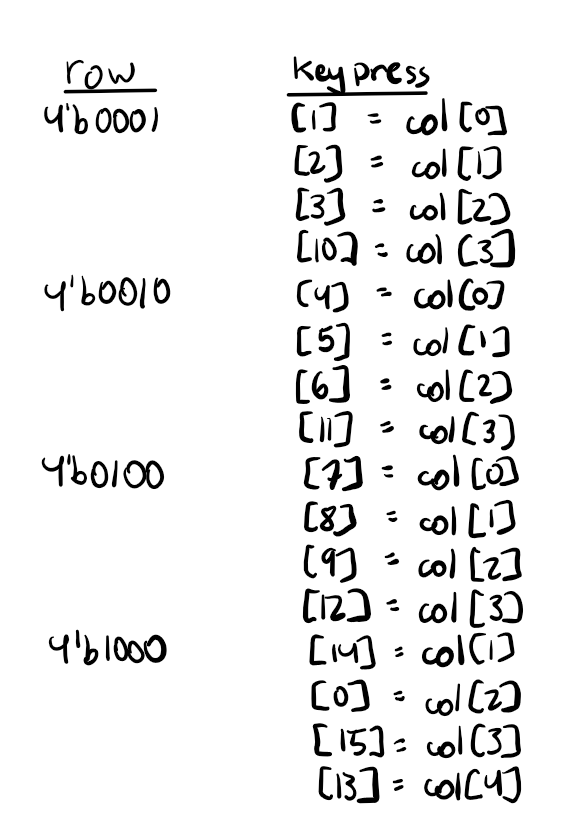
:::

To test this FSM I ran tests to ensure that given which row was asserted, the column values mapped to the correct digit in the keypress output. 

::: {.callout-caution collapse="true" title="spoiler: pressed module testbench waveforms and tests"}
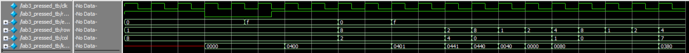
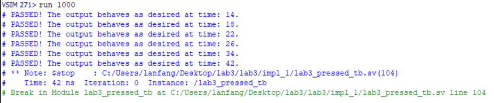
:::

This state was then sent to a display state module which first raised flags for all non-valid conditions (no key pressed, multiple keys pressed, or one button held down) then used those flags to enable a system that mapped to the output. 

::: {.callout-caution collapse="true" title="spoiler: display state block diagram"}
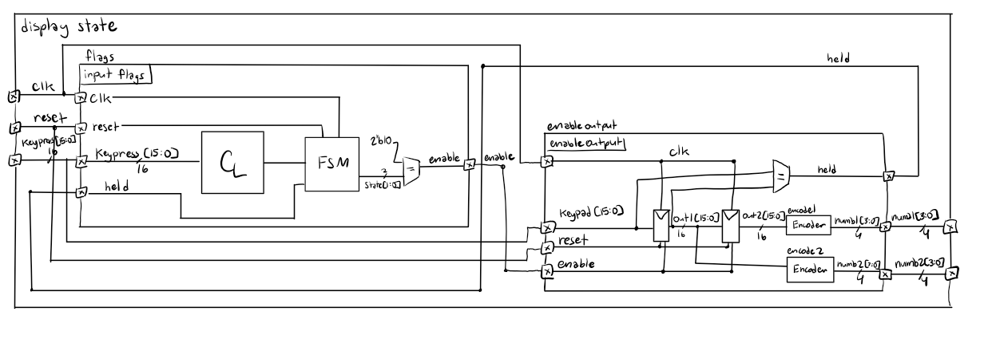
:::

::: {.callout-caution collapse="true" title="spoiler: display state state transition diagram"}
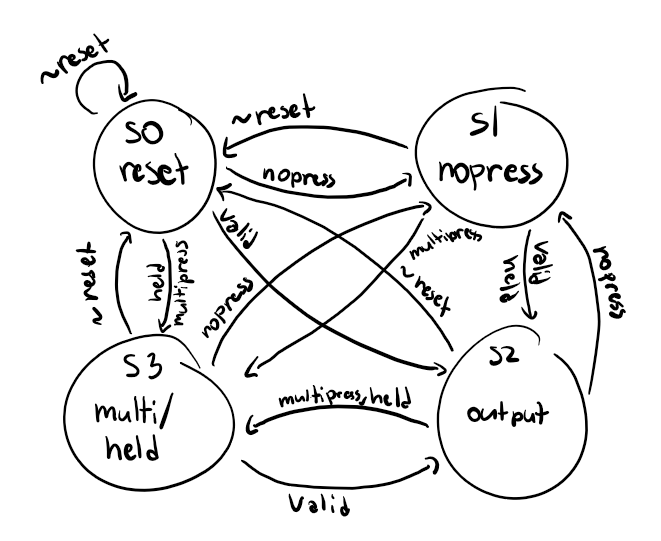
:::

::: {.callout-caution collapse="true" title="spoiler: input flags state table"}
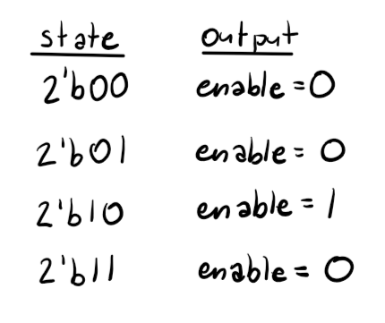
:::

For simplicity, this module was later split into three sub modules where on handled the flags and state, one handled the output logic, and an additional encoder was used to convert from the 16 bit output to the 4 bit output used by subsequent modules. However, the testbenches were executed for the display state module and enable module to maintain simplicity. 

::: {.callout-caution collapse="true" title="spoiler: displaystate testbench waveforms and tests"}
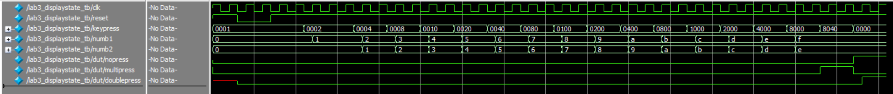
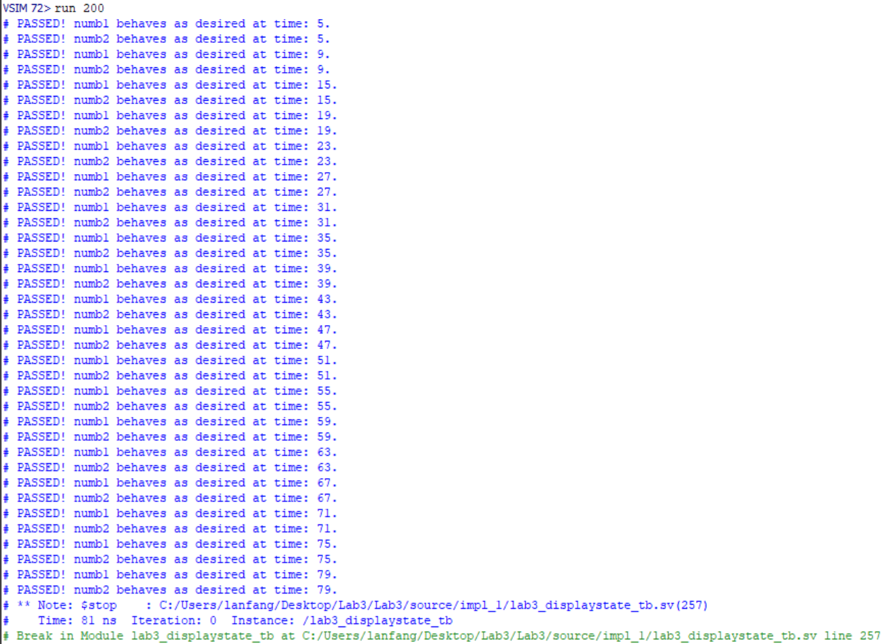
:::

::: {.callout-caution collapse="true" title="spoiler: encoder testbench waveforms and tests"}
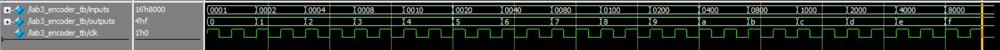
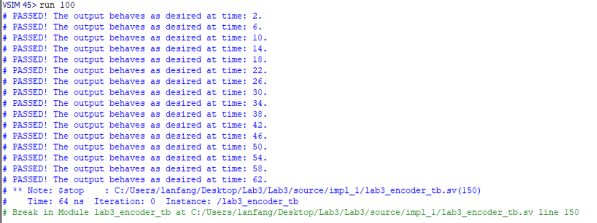
:::

Finally, the correct numbers were fed into a mux followed by the 7-segment display output logic. Both the mux and seg7 modules have been tested in previous labs. 

::: {.callout-caution collapse="true" title="spoiler: muxcounter block diagram"}
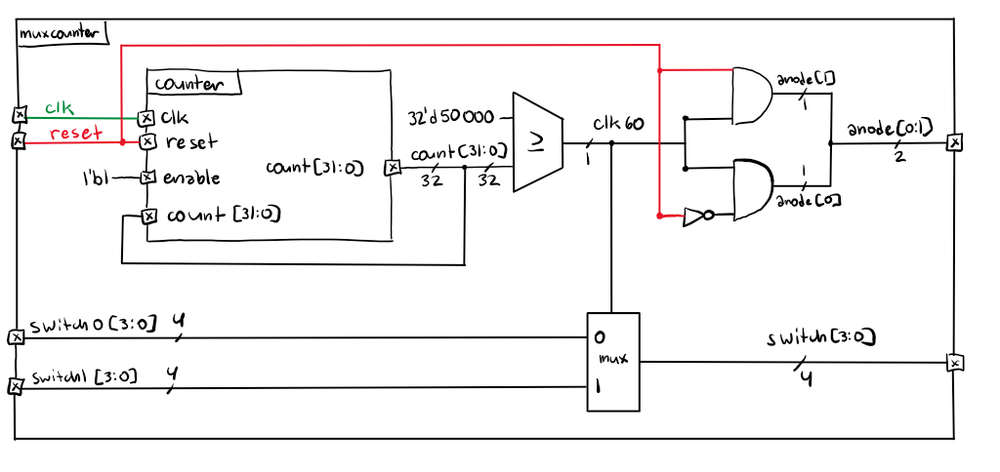
:::

To evalute the whole design, I coded a testbench to minimic general inputs including switchbounce and signals following both on and offset from the clock cycle. I also verified that inputs were being fed between subsequent modules correctly. 

::: {.callout-caution collapse="true" title="spolier: top testbench waveform"}
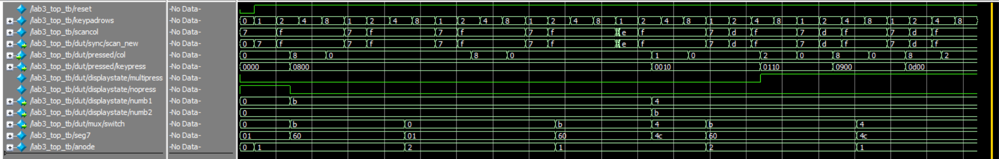
:::

## Technical Documentation

The schematic and block diagram below show the layout of modules and the wiring of the board. 

I chose to make my FSMs communicate primarily by sending enable singals to one another so that they only activiated at the appropriate time. My only cannonical FSM is the display state FSM, specifically the flagging module. I used a cannonical FSM becuase there were only 4 states that needed to be covered. I used non-cannonical FSMs for anything initiated with a counter because of the sheer volume of states, such as for my debouncing module. I used communicating FSMs for various instances where I just wanted to enable a flop to pass values. The communicating FSMs did cause some issues with timing and accounting for behavior across multiple clock cycles which was a major drawback. However, they also allowed for my other FSMs to remain in proper cannonical or noncannonical form. The biggest issue for me was getting the doublepress condition to work because of the clock cycles required to feed it between modules. I ended up solving this by adding an additional flipflop to help with timeing. 

::: {.callout-caution collapse="true" title="spoiler: schematic and block diagram for Lab 3 9/20/26 by Lily Anfang"}
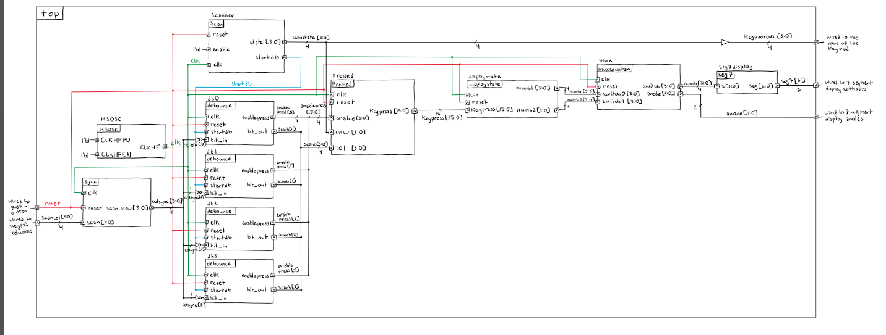
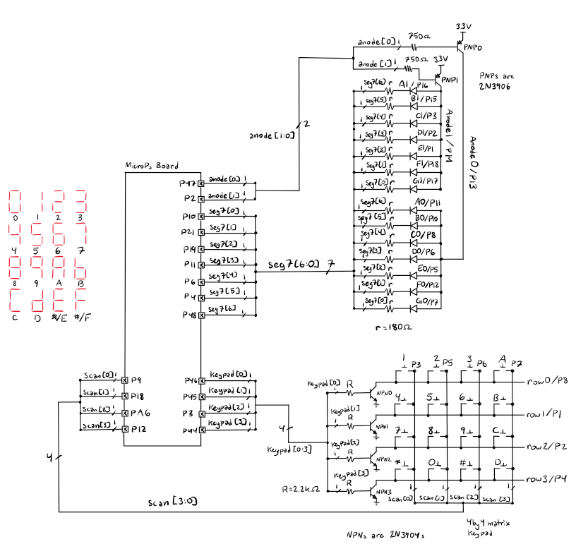
:::

## Code

Below is my code for the modules, testbenches, and AI reflection.

[code](https://github.com/lilyanfang/hmc-e155-lab3)

## Hardware Results

After some updates to the cycle time and a slight variation in how the code handled a single button being pushed twice, the hardware worked successfully. The code can successfully handle the multipress, held, and repeated press conditions. Additionally, the numbers on the display move right to left as instructed. 

::: {.callout-important collapse="false" title="hardware setup"}

:::

## Conclusion

In this lab I programed my board to drive two 7-segment displays with the two most recent inputs from a keypad using debouncing methods and various FSMs.  

This lab took me 20 hours.

## AI Prototype Summary

I used Gemini to write the code. It wrote code that successfully that did not successfully synthesize. It had a repeated error where it would incorrectly write the 4 bit binary string using syntax that wasn't in system verilog. Ironically, it would often comment that the code was incorrect and then put the correct version below but it wouldn't comment out the problem line resulting in synthesis issues. Once I commented out the mistake lines the code compiled fine and looked similar to the code I had been using. 