## Introduction

The goal of this lab was to code an MCU such that is could drive a speaker circuit through an enabled GPIO pin using timer peripherals. The code should take in a list of paired frequency and durations lists and convert them into a series of square waves to drive the amplifier circuit. 

## Design and Testing Methodology

To design the code I started by creating header and .c files for the clock, GPIO, and TIMx configurations based on the ones provided in the clock configuration practice problem. I used the MSI clock running at 4MHz as my system clock and used it to power my timers. I chose to use TIM6 and TIM7 as my timers because they have very simple designs. I configured TIM6 to count to 3999 to convert from the 4MHz clock to a 1kHz clock so that it sent out an overload flag every millisecond. I configured TIM7 to have an overload flag every 1 microsecond but this was later reset in my main module based on the desired frequency. 

In my main module, I chose to use GPIOB_4 as my output pin. I then ran my initial clock configurations, GPIO configuration, and timer configurations to set up all my pins and peripherals. I then used some intial processing to convert to find the number of paired frequencies and durations in the input array. I then used nested for and while loops to execute the counting functions.

To account for the possibility of a rest, I first use a boolean to check if the input frequency is zero. If the frequency isn't zero, I then calculate what I want TIM7 to count up to using the equation below. I divide by a factor of two becuase I want to create a 50% duty cycle square wave so I need to toggle the bit at twice the desired frequency. I then subtract one off of this to account for indexing begining at zero. 

::: {.callout-caution collapse="true" title="spoiler: Equation for Count"}
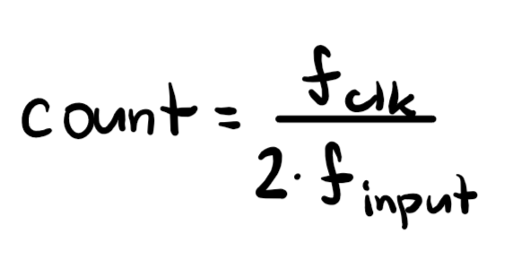
:::

Given how I choose to convert from the given frequency to the counter value, there is some error for the output frequency. This is because the code truncates non-integer values since I set the count as an int. However, the error is less than 1% for all frequencies in the given code as shown in the table below. In this case, checking the minimum and maximum frequency values is not sufficent to prove the error stays within bounds because the error depends both on the input frequency's size as well as the difference between the exact and truncated count. However, the maximum frequency for which there is garunteed to be less than 1% error can be calculated using the equation below. For the given clock speed, this value is found to be 20kHz which is at the top of the human hearing range. Additionally, the minumum freuency is set by the maximum value of count which is a 16 bit integer so it is 31Hz. 

::: {.callout-caution collapse="true" title="spoiler: Frequency Error Calculations"}
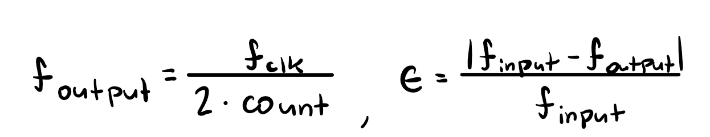
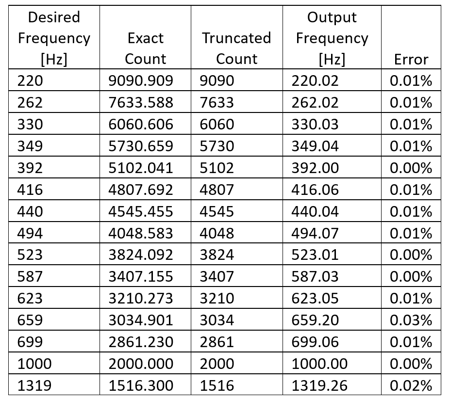
:::

::: {.callout-caution collapse="true" title="spoiler: Equation for Maximum Frequency"}
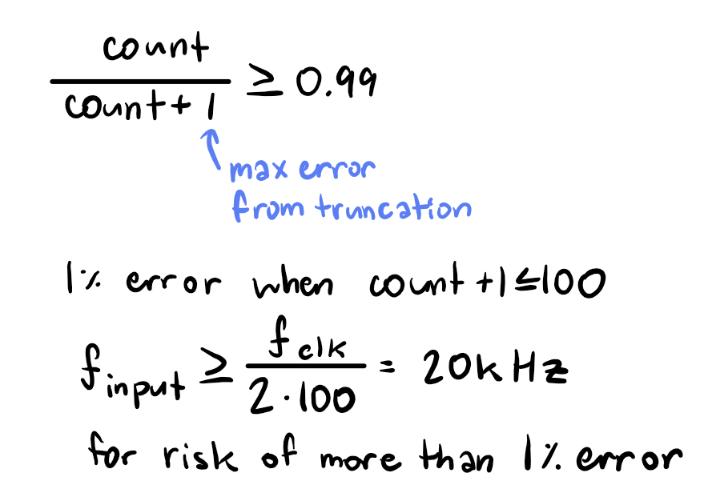
:::

::: {.callout-caution collapse="true" title="spoiler: Equation for Minimum Frequency"}
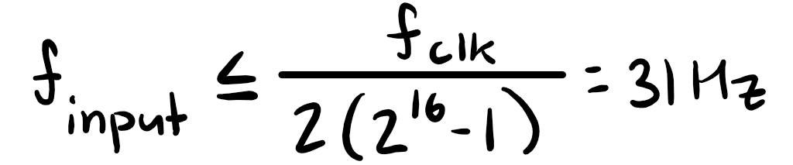
:::

To then actually operate the timers, I have then count up to the max count at which point they output a flag. I then use this flag to flip the output bit for TIM7 (which controls the output frequency) and to end a while loop for TIM6 (which controls the duration). I then set the flag back to zero and researt the counters.

To control the duration of a note, I have a while loop where each iteration of the loop lasts 1ms and increments down until the time remaining is 0. If the input frequency isn't a rest, the output pin should toggle while the loop increments and if the it is a rest, the pin shouldn't change. Because of this method of implementation, the minimum supported duration for a note is the length of one counting cycle, which is 1ms given the clock has a frequency of 4MHz and counts to 3999. Conversely, the maximum clock cycle duration is the determined by the largest value that can be input into a an unsigned 32 bit integer which results to 65.535s. However, because there is very little pause between notes, a longer duration could be broken into multiple notes of the max duration with very little difference in quality. 

::: {.callout-caution collapse="true" title="spoiler: Equations for Minimum & Maximum Duration"}
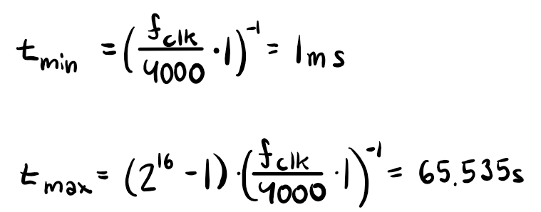
:::

## Technical Documentation

My design for the audio amplifier is shown below. This design is largely based on the recommended use schematic for a gain of 20 from the datasheet. Given that the output voltage from the GPIO pin is around 4.6V for a high output and the output from the amplifier should have a peak to peak voltage of 2.8V I made a voltage divider with a 10kohm pot to ensure that the output voltage remained in spec and allow for volume control. 

::: {.callout-caution collapse="true" title="spoiler: Design of the Volume Control"}
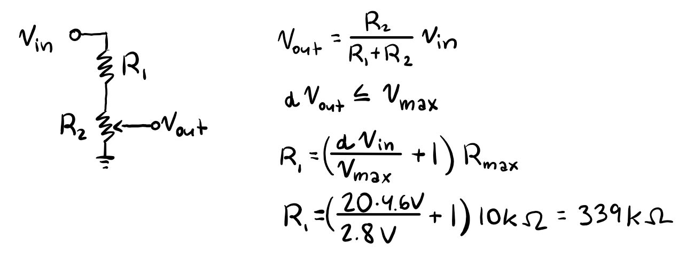
:::

::: {.callout-caution collapse="true" title="spoiler: Schematic"}
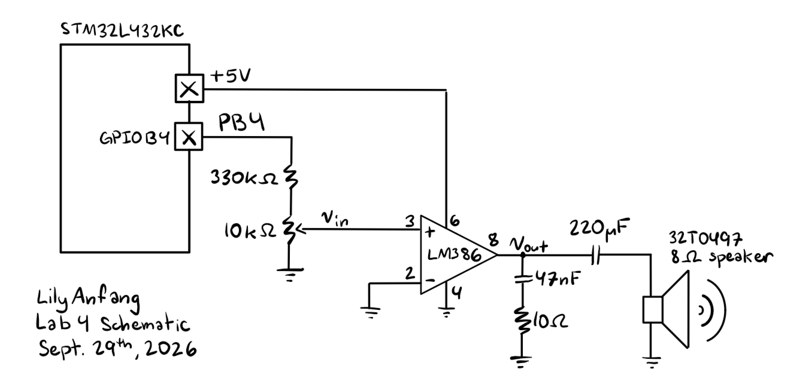
:::

For the design on the development board. The OUTPUT macro in my code maps to GPIOB_4 which is pin 15 on the MCU and PB4 on the board. Additionally, my design uses the MSI clock and timers TIM6 and TIM7 which are all internal to the MCU. 

[Development Board Schematic](https://hmc-e155.github.io/assets/doc/E155%20FA22%20Development%20Board%20Schematic.pdf)

## Code

[Lab 4 Repo](https://github.com/lilyanfang/hmc-e155-lab4)

In addition to the starter code, I also added my own muscial arrangement of Seven Nation Army by The White Stripes. 

::: {.callout-important collapse="false" title="Sheet Music and Mapping For Seven Nation Army"}
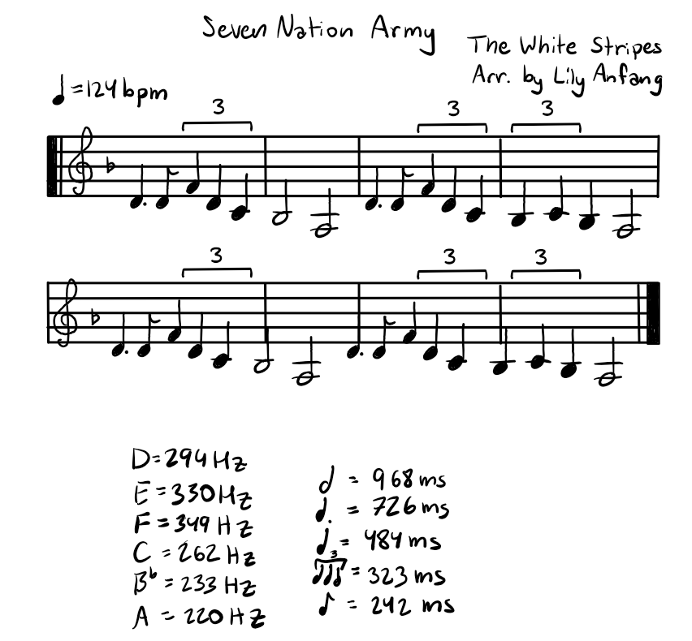
:::

## Hardware Results

The hardware works as expected. Für Elise is played at the correct frequency for duration for the notes. The rests are also correctly observed. The volume control also works with the input and output voltages still staying fully in spec when the volume is set to max (shown below). The volume range also covers the whole range of the pot. 

::: {.callout-caution collapse="true" title="spoiler: Oscilliscope Traces for Input and Output Voltages through the Audio Amp with Max Volume"}
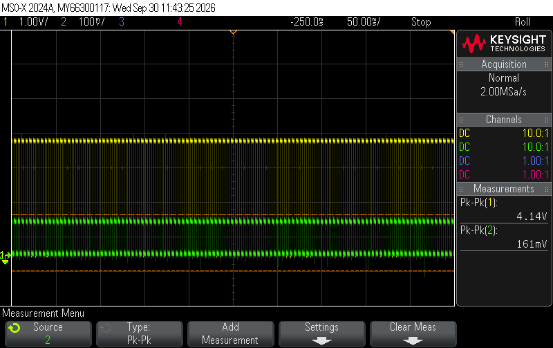
Trace of pin output (yellow) and input voltage to the LM386 (green)
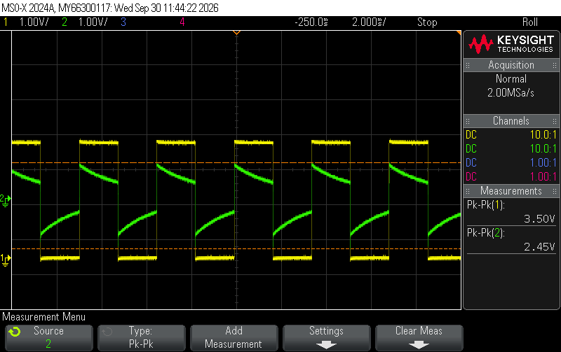
Trace of pin output (yellow) and output voltage from the LM386 (green)
:::

::: {.callout-caution collapse="true" title="spoiler: Hardware Layout"}
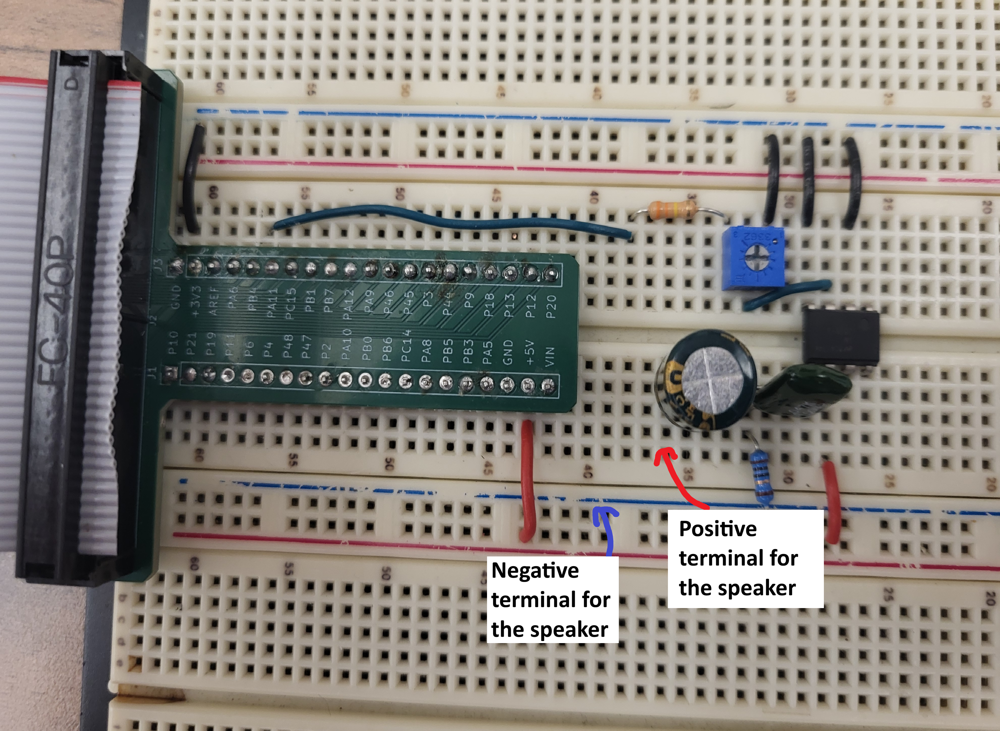
:::

## Conclusion

In conclusion, I coded an MCU and built an audio amplification circuit that can play music from any array containing note durations and frequencies so long as the durations and frequencies are within bounds.
I spent 14 hours on this lab. 

## AI Prototype Summary

Gemini answered the question technically correctly as it successfully described how to use timers TIM15 and TIM16. It correctly showed the equations that were relevant as well as the bits that needed to be set. However, its answer differed from mine because it chose more complex timers when TIM6 and TIM7 are easier to implement and can still satisfy all requirements. Given that it was specifically asked to choose timers that easily map to output pins I understand why it might have thought TIM15 and TIM16 were better given that they have physical output channels. However, when I asked why it didn't say TIM6 and TIM7 it incorrectly claimed that they couldn't be used for this task. This is a flase statement because while they require mapping to a GPIO pin, the prompt asks for "easy mapping" not "direct mapping". 